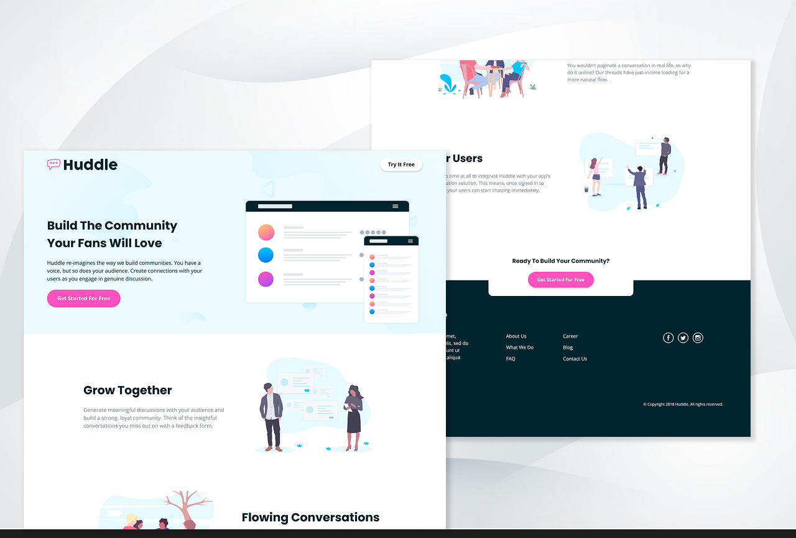
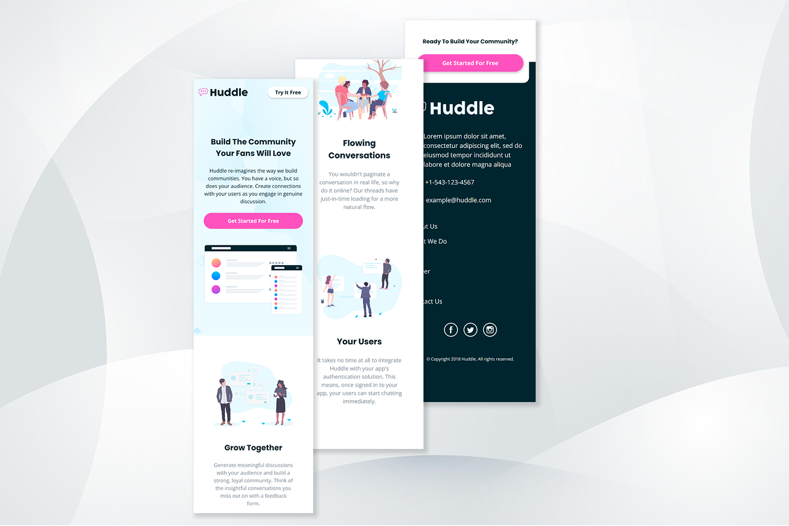

# 📌 Huddle landing page with alternating feature blocks

**Projeto desenvolvido a partir de um desafio do Frontend Mentor**

O layout foi desenvolvido seguindo a abordagem Mobile-first, priorizando responsividade e melhor experiência do usuário em diferentes dispositivos. Fiz uso extensivo do `display: grid;` para estruturar o layout ao longo dos breakpoints necessários. 

---

## 🚀 Tecnologias utilizadas
- HTML5  
- CSS3  
- CSS Grid (`minmax()`, `repeat()`, `auto-fit`)
- Responsividade fluida (`clamp()`, `vw`, `rem`)  
- SVG Sprite
- Mobile-First  
- Media Queries  

---

## 📱 Layout

A responsividade foi ajustada com breakpoints definidos nos pontos em que o layout apresentava quebra, garantindo consistência visual em diferentes resoluções para diferentes dispositivos.

---

## 🧩 O que foi praticado

- Melhoria na consistência da metodologia **BEM** e em nomenclaturas no HTML
- Melhor entendimento sobre a organização no css
- Melhora no design de landing pages

---

## 🖼️ Prévia do projeto (Desktop & Mobile)

    
    

---

## 🔗 Links
- **Projeto online:** https://daviwebdev.github.io/huddle-landing-page-with-alternating-feature-blocks
- **Desafio:** https://www.frontendmentor.io/challenges/huddle-landing-page-with-alternating-feature-blocks-5ca5f5981e82137ec91a5100

